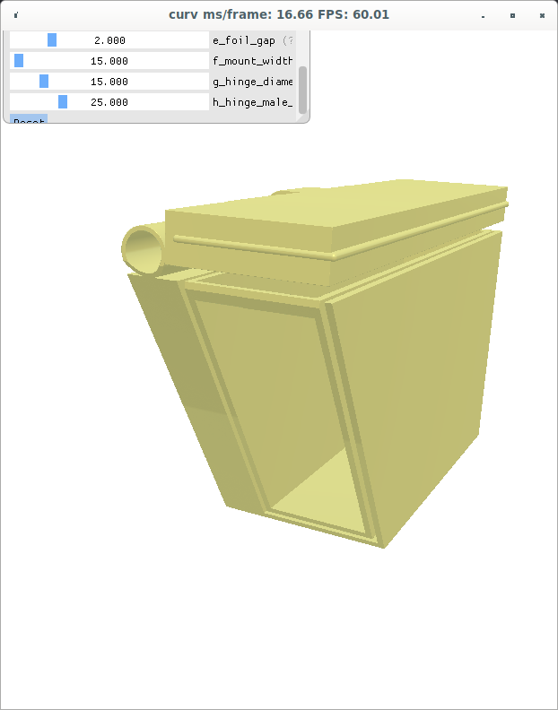
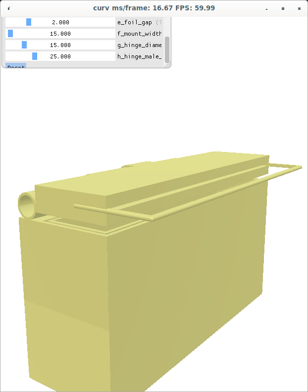

# ArcaAether - Faraday Box

Stop signals from entering or escaping with this faraday box. Usually sold for
$20 USD, you can now 3D print one specifically for your needs, meeting your
standards, using materials you trust.

There are two versions of this product: stylish and functional.

The functional version has zero styling, and purely to get the job done. This
should be used as a base to create your own variants.

The stylish variant is an opinionated version which is non-free and is a
consumer product. It is functionally equivalent to the functional version
and offers no extra features. You can inquiry about it at https://kolofe.com if
you wish.

